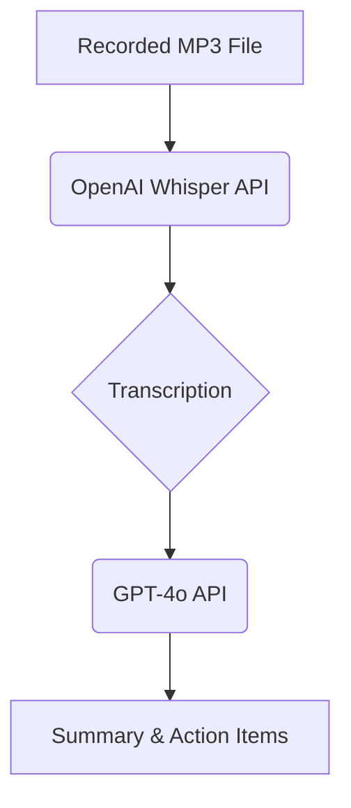
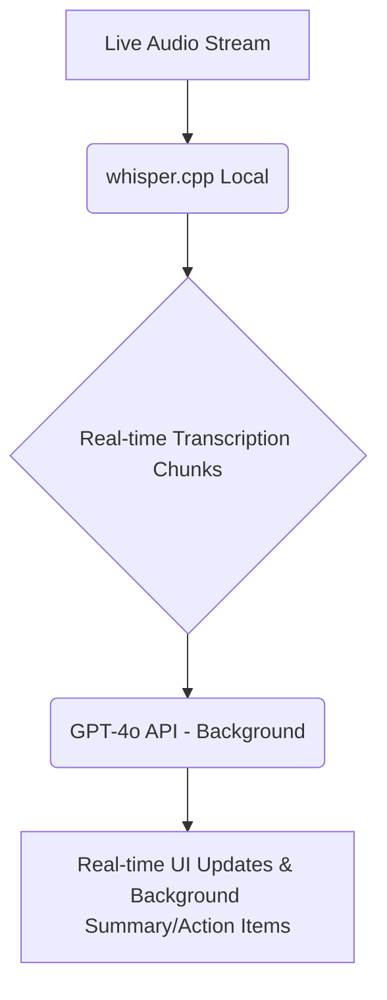

# Project Journey: Building the Fireflies Clone

## Stage 1: Finding My Bearings - Initial Requirements & Prototype

At the outset of this project, the primary goal was to simulate the core functionalities of a meeting transcription and note-taking service. This involved figuring out what was required to build four key components:

1.  **Meeting Recording**: Capturing audio from users.
2.  **Transcription**: Converting spoken words into text.
3.  **Summary and Action Items**: Generating concise summaries and identifying actionable tasks from the transcription using AI.
4.  **A Functioning UI**: Providing an interactive interface for users.

Initially, I decided to focus on processing recorded MP3 files, as it seemed a simpler starting point to grasp the fundamental concepts. My raw plan for the first working prototype was straightforward: utilize OpenAI's Whisper API for transcribing the audio, and then feed the resulting transcription into GPT-4o for generating summaries and action items.

Key AI-tooling used:
v0.dev (fast UI prototyping)
ChatGPT
Cursor

Here's a diagram illustrating this initial prototype architecture:



This initial approach led to our first working prototype and, crucially, our first set of questions and challenges to address.

## Stage 2: Addressing Real-time Challenges - Iteration on Transcription

One major limitation quickly became apparent: OpenAI's Whisper API, while excellent for batch processing, did not support real-time audio streaming. This immediately raised two critical issues for a live meeting transcription service:

*   **How do we process user voice in real-time?**
*   **What is the best strategy for chunking audio, and how do we battle the higher latency introduced by sending and receiving chunks over an API?**

These latency and streaming concerns were major roadblocks. I decided to look for alternatives, and `whisper.cpp` emerged as a promising solution. Being able to run `whisper.cpp` locally meant that real-time audio data could be sent directly to it, effectively solving both the streaming and latency issues we encountered with the OpenAI API.

This led to our second, improved implementation: real-time audio transcription with summaries happening in the background. This was a good start, but as often happens in development, new challenges arose. (Before this, it's worth noting, we went down a rabbit hole of UI improvements that consumed some time!)

Here's an overview of the improved real-time architecture:



## Stage 3: The Speaker Diarization Hurdle & Final Solution

Despite the progress with real-time transcription, we ran into another significant issue: **speaker diarization**. Our `whisper.cpp` model would return a single, undifferentiated blob of transcribed text. This was essentially useless for a meeting transcription service, as we needed to know *who* said *what*, *when*, and in *what order*. Identifying individual speakers was a major missing piece.

Building intelligent speaker diarization locally proved to be unfeasible given the project's scope and resources. After some research, I discovered AssemblyAI, which offered intelligent speaker diarization as a built-in feature. This was a game-changer and answered the final major issue for us.

Moving to AssemblyAI for transcription (which includes diarization) and continuing to use GPT-4o for analysis also had an added benefit: we observed a significant latency reduction, shaving off 400-600ms compared to our earlier methods. This entire journey, from initial concept to a robust, real-time, speaker-diarized solution, was a truly enjoyable and insightful experience.

## Deep Dive: Speaker Diarization Capabilities & Setup

# Speaker Diarization Setup Guide

## Overview

Your Fireflies Clone now supports intelligent speaker diarization (identifying who is speaking when) to provide more structured and readable transcriptions. Instead of getting a single block of text, you'll get clearly formatted speaker blocks like:

```
┌─────────────────────────────────────────────────────────────┐
│ 🔵 Speaker A:                                               │
│    Around the time, in September, we had an internal       │
│    hackathon. Everyone was free to build basically         │
│    whatever they wanted to build.                          │
└─────────────────────────────────────────────────────────────┘

┌─────────────────────────────────────────────────────────────┐
│ 🔵 Speaker B:                                               │
│    But it turns out everyone just built on MCP. It was     │
│    crazy. Everyone's ideas were, Oh, but what if we made   │
│    this an MCP server?                                     │
└─────────────────────────────────────────────────────────────┘

┌─────────────────────────────────────────────────────────────┐
│ 🔵 Speaker A:                                               │
│    I'm a member of Tactical Staff at Anthropic and one     │
│    of the co-creators of MCP. Today, we're going to be     │
│    talking about the Model Context Protocol...             │
└─────────────────────────────────────────────────────────────┘
```

Each speaker gets their own visually distinct block with:
- **Color-coded speaker labels** with visual indicators
- **Separate paragraphs** for easy reading
- **Hover effects** for better interaction
- **Chronological order** maintaining conversation flow

### Multi-Speaker Examples

**2-Speaker Meeting (Interview):**
```
🔵 Speaker A: Welcome to the interview. Can you tell me about yourself?
🔵 Speaker B: Thank you! I'm a software engineer with 5 years of experience...
```

**4-Speaker Team Meeting:**
```
🔵 Speaker A: Let's start the sprint planning meeting.
🔵 Speaker B: I've completed the user authentication feature.
🔵 Speaker C: The database migration is ready for testing.
🔵 Speaker D: Should we discuss the API endpoints next?
```

**6+ Speaker Conference Call:**
```
🔵 Speaker A: Good morning everyone, thanks for joining.
🔵 Speaker B: The Q3 numbers are looking strong.
🔵 Speaker C: Marketing campaign performed above expectations.
🔵 Speaker D: I have concerns about the budget allocation.
🔵 Speaker E: Let's address those concerns one by one.
🔵 Speaker F: I can provide additional context on that.
```

## Possible Improvments:

Possible improvements would be:
1) To be able to interact with all historical meetings and retrieve action items or insights from a large timeline of meetings 

2) MCP server being fed important documents and new meeting meta-data to allow fireflies LLM to readily aid the user in between meetings

## Setup Options

### Option 1: AssemblyAI (Recommended)

AssemblyAI provides excellent speaker diarization with high accuracy and is the recommended solution.

#### Steps:
1. Sign up for a free AssemblyAI account at https://www.assemblyai.com/
2. Get your API key from the dashboard
3. Add it to your environment variables:
   ```bash
   # In your .env file
   ASSEMBLYAI_API_KEY=your_assemblyai_api_key_here
   ```

#### Pricing:
- Free tier: 3 hours of transcription per month
- Pay-as-you-go: $0.37 per hour of audio
- Much more affordable than other enterprise solutions

### Option 2: OpenAI Only (Fallback)

If AssemblyAI is not configured, the system will fall back to OpenAI API without speaker diarization.

## Speaker Detection Capabilities

### How Many Speakers Can It Handle?

**🎯 The system is NOT limited to 2 speakers!** Here are the actual capabilities:

#### **File Upload Transcription:**
- **Up to 10+ speakers** with high accuracy
- **Unlimited auto-detection** (recommended for most use cases)
- **Manual configuration** if you know the exact number

#### **Real-time Streaming:**
- **Up to 5-6 speakers** reliably in real-time
- **Auto-detection works best** for most meetings
- **Performance optimized** for typical meeting scenarios

### Speaker Configuration Options

You can configure speaker detection in three ways:

1. **🚀 Auto-Detection (Recommended):** Leave `SPEAKERS_EXPECTED` unset
   - Automatically detects any number of speakers
   - Best for most use cases
   - No configuration needed

2. **🎯 Fixed Number:** Set `SPEAKERS_EXPECTED=5` for exactly 5 speakers
   - Slightly better accuracy when you know the exact count
   - Useful for structured meetings

3. **⚡ High Performance:** Set lower numbers for faster processing
   - Use `SPEAKERS_EXPECTED=2` for simple 1-on-1 interviews
   - Faster processing for known scenarios

## Configuration

### Environment Variables

Add these to your `.env` file:

```env
# Required: OpenAI API key for transcription and AI analysis
OPENAI_API_KEY=your_openai_api_key_here

# Optional but recommended: AssemblyAI for speaker diarization
ASSEMBLYAI_API_KEY=your_assemblyai_api_key_here

# Optional: Configure expected number of speakers (leave unset for auto-detection)
# SPEAKERS_EXPECTED=3  # Set to specific number if known, or omit for unlimited auto-detection

# Database configuration
DATABASE_URL=./data/sqlite.db

# Server configuration
NODE_ENV=development
PORT=3000

# Upload configuration
MAX_FILE_SIZE=50MB
UPLOAD_DIR=./uploads
```

### Docker Setup

If you're using Docker (recommended for development):

```bash
# Build and run with the new features
docker-compose build fireflies-dev --no-cache
docker-compose --profile dev up fireflies-dev

# Or using the npm scripts
npm run docker:dev
```

## How It Works

### 1. Audio Processing Pipeline

1. **File Upload**: Audio files are uploaded through the web interface
2. **Speaker Detection**: AssemblyAI analyzes the audio for different speakers
3. **Transcription**: Each speaker's segments are transcribed separately
4. **Formatting**: Output is formatted with clear speaker labels
5. **Database Storage**: Both raw text and speaker-segmented data are stored

### 2. Real-time Transcription with Speaker Diarization

The system now supports live speaker diarization during real-time recording sessions:

#### Features:
- **Live Speaker Detection**: See who's speaking in real-time during recording
- **Partial Transcription**: View transcription as it happens with speaker labels
- **Speaker Status Indicators**: Visual feedback showing current speaker and listening status
- **Formatted Output**: Speaker-labeled final transcript with visual indicators
- **Seamless Fallback**: Works even without AssemblyAI configured

#### Real-Time UI Features:
- **Speaker Status Panel**: Shows current speaker and listening status
- **Live Transcription Display**: Enhanced with speaker badges and formatting
- **Partial Text Preview**: See what's being transcribed before it's final
- **Speaker Detection Indicators**: Visual cues for active speaker identification

#### How Real-Time Works:
1. **WebSocket Connection**: Establishes real-time connection to AssemblyAI
2. **Audio Streaming**: Sends audio chunks as they're recorded
3. **Live Processing**: Receives partial and final transcriptions with speaker labels
4. **Visual Feedback**: Updates UI with speaker information and partial text
5. **Formatted Storage**: Saves complete speaker-labeled transcript

### 3. Fallback Mechanism

If AssemblyAI is not available or configured:
- System falls back to OpenAI API
- Provides regular transcription without speaker labels
- No functionality is lost

## API Response Format

### With Speaker Diarization:
```json
{
  "text": "Around the time, in September, we had an internal hackathon...",
  "formattedText": "**Speaker A:** Around the time, in September, we had an internal hackathon...\n\n**Speaker B:** But it turns out everyone just built on MCP...",
  "speakers": [
    {
      "speaker": "Speaker A",
      "text": "Around the time, in September, we had an internal hackathon. Everyone was free to build basically whatever they wanted to build.",
      "start": 0,
      "end": 5.2,
      "confidence": 0.95
    },
    {
      "speaker": "Speaker B", 
      "text": "But it turns out everyone just built on MCP. It was crazy.",
      "start": 5.3,
      "end": 9.1,
      "confidence": 0.92
    }
  ]
}
```

### Without Speaker Diarization:
```json
{
  "text": "Around the time, in September, we had an internal hackathon. Everyone was free to build basically whatever they wanted to build. But it turns out everyone just built on MCP...",
  "formattedText": "Around the time, in September, we had an internal hackathon. Everyone was free to build basically whatever they wanted to build. But it turns out everyone just built on MCP...",
  "speakers": null
}
```

## Database Schema

The system stores speaker information in the `transcriptions` table:

```sql
CREATE TABLE transcriptions (
  id INTEGER PRIMARY KEY AUTOINCREMENT,
  meeting_id INTEGER NOT NULL,
  text TEXT NOT NULL,
  confidence REAL,
  language TEXT,
  speakers TEXT, -- JSON string of speaker segments
  created_at TEXT NOT NULL DEFAULT CURRENT_TIMESTAMP
);
```

## Frontend Integration

The frontend automatically displays speaker-labeled transcriptions when available:

1. **Upload Interface**: Same as before, no changes needed
2. **Results Display**: Automatically shows speaker labels when available
3. **Real-time Recording**: Shows live speaker identification during recording

## Troubleshooting

### Common Issues:

1. **"AssemblyAI API key not configured"**
   - Solution: Add `ASSEMBLYAI_API_KEY` to your `.env` file

2. **"Failed to transcribe audio with speaker diarization"**
   - Check your AssemblyAI API key is valid
   - Verify you have sufficient credits
   - System will automatically fall back to OpenAI

3. **Speaker labels not appearing**
   - Ensure audio has multiple speakers
   - Check that speakers are distinct enough for detection
   - Some single-speaker audio may not show speaker labels

4. **Too few speakers detected**
   - Remove `SPEAKERS_EXPECTED` from .env to enable auto-detection
   - Ensure speakers have distinct voices and don't overlap too much
   - Try with higher quality audio

5. **Too many speakers detected**
   - Set `SPEAKERS_EXPECTED=X` where X is the actual number of speakers
   - This can happen with background noise or echo
   - Use better audio recording conditions

### Debug Mode:

Check the Docker logs to see what's happening:
```bash
docker logs fireflies-clone-dev --tail 20
```

## Performance Considerations

### AssemblyAI:
- **Processing Time**: ~1-2 minutes for a 10-minute audio file
- **Accuracy**: Very high for clear audio with distinct speakers
- **Supported Formats**: MP3, WAV, M4A, MP4, WebM

### Best Practices:
1. **Audio Quality**: Use high-quality audio for best results
2. **Speaker Separation**: Ensure speakers don't talk over each other too much
3. **Microphone Setup**: Use separate microphones when possible
4. **File Size**: Keep files under 25MB for optimal processing

## Cost Estimation

### AssemblyAI Pricing Examples:
- **30-minute meeting**: ~$0.19
- **1-hour meeting**: ~$0.37
- **Daily 4-hour meetings**: ~$44/month
- **100 hours/month**: ~$37/month

Much more affordable than hiring human transcribers at $1-3 per minute!

## Next Steps

1. **Set up AssemblyAI**: Get your API key and add it to `.env`
2. **Configure speakers**: 
   - Leave `SPEAKERS_EXPECTED` unset for auto-detection (recommended)
   - Or set `SPEAKERS_EXPECTED=3` if you know exactly how many speakers
3. **Test with sample audio**: Upload a multi-speaker recording
4. **Try different speaker counts**: Test with 2, 4, 6+ speaker recordings
5. **Integrate with your workflow**: Use the API to build custom integrations

## Support

If you encounter issues:
1. Check the logs using `docker logs fireflies-clone-dev`
2. Verify your API keys are correct
3. Test with a simple 2-speaker audio file first
4. Check the AssemblyAI dashboard for usage and errors

Your transcription quality should now be significantly improved with clear speaker identification! 